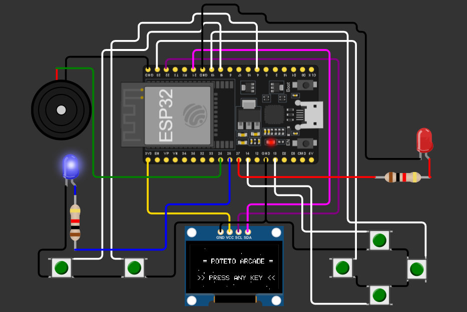
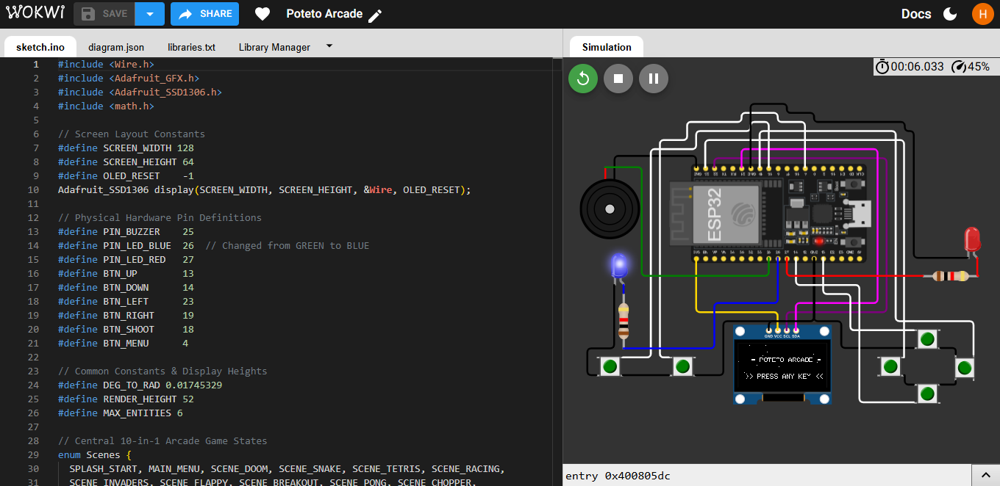

# 🕹️ POTETO ARCADE: 10-in-1 ESP32 Retro Gaming Console

An advanced embedded systems project featuring **10 classic arcade games** packed into a single ESP32 chip. The project features custom game engines—including a lightweight, raycasted pseudo-3D engine—written in optimized C++ and rendered onto an absolute budget 128x64 SSD1306 OLED display.

---

## 📺 Hardware Demonstration

> 💡 *Check out the console running on physical hardware below!*


---

## 🚀 Key Features
* **10 Games in 1:** Seamlessly switch between 10 full retro titles via a graphic on-screen boot menu.
* **3D Raycasting Engine:** Features a custom-built, highly optimized 3D engine to render pseudo-3D environments (Doom-style) on an absolute performance budget.
* **Audio Feedback:** Integrated passive buzzer system providing distinct chiptune sound effects for game events, jumps, and actions.
* **Hardware Optimized:** Custom C++ code leveraging the `Adafruit_GFX` and `Adafruit_SSD1306` libraries, engineered to maximize frame rates and remove input lag on the ESP32.

---

## 🔌 Hardware Architecture & Circuit Design

The circuit is designed for a standalone handheld configuration. Below is the blueprint showing how the ESP32, peripherals, and I/O buttons hook up:



### 📌 System Pin Mapping

| Component | ESP32 Pin | Wire Color (Schematic) | Description |
| :--- | :--- | :--- | :--- |
| **OLED Display (SDA)** | Pin 21 | 🟡 Yellow | I2C Data Line |
| **OLED Display (SCL)** | Pin 22 | 🔵 Blue | I2C Clock Line |
| **Buzzer** | Pin 25 | 🟢 Green | Audio Output (Chiptunes) |
| **Green LED** | Pin 26 | 🔵 Blue | Status / Action Indicator |
| **Red LED** | Pin 27 | 🔴 Red | System Power / Event Indicator |
| **Button UP** | Pin 13 | ⚪ White | D-Pad Navigation |
| **Button DOWN** | Pin 14 | ⚪ White | D-Pad Navigation |
| **Button LEFT** | Pin 23 | ⚪ White | D-Pad Navigation |
| **Button RIGHT** | Pin 19 | ⚪ White | D-Pad Navigation |
| **Button SHOOT** | Pin 18 | 🟣 Purple | Primary Action Key |
| **Button MENU** | Pin 4 | 🟣 Purple | Menu / Back Key |

---

## 💻 Simulation & Development Environment

To ensure stable pin configurations, software debouncing for the tactile switches, and memory optimization before physical assembly, the prototype was fully simulated using the Wokwi virtual workspace.



🤖 **Want to test it out?** [Click here to launch the live interactive Wokwi simulation workspace!](https://wokwi.com/projects/467424344697831425)

---

## 🛠️ Installation & Compilation Setup

To flash this code onto your own physical ESP32 hardware:

1. **Clone this repository:**
```bash
   git clone [https://github.com/muhammadhassan-zia/poteto-arcade-esp32.git](https://github.com/muhammadhassan-zia/poteto-arcade-esp32.git)
